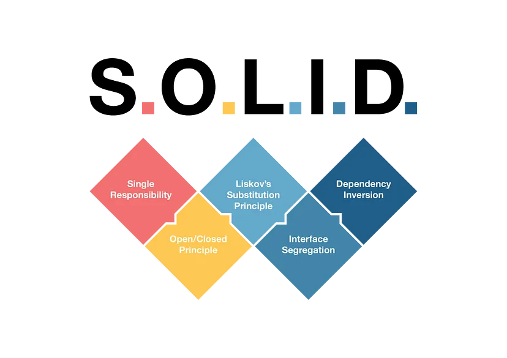

### In the world of software development, creating maintainable, flexible, and scalable code is a top priority. 
### To achieve this, software engineers often turn to design principles that guide them in writing clean and robust code.
### One such set of principles is the SOLID principles, which provide a framework for designing well-structured and maintainable object-oriented software. 
### In this article, we’ll delve into the SOLID principles and explore how they can be applied in Java, complete with practical examples.

